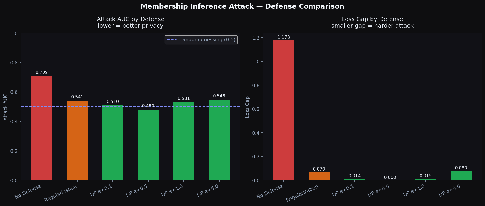

# Membership Inference Attack

A simulation of membership inference attacks against machine learning models, demonstrating how overfitting leaks private training data and how differential privacy defends against it. Built to explore the privacy vulnerabilities in healthcare AI systems.

## The Core Idea

Imagine a hospital trains an AI model to predict diabetes using patient records. You are an attacker and you want to know as an example; was Alice's medical record used to train this model?

This is called a membership inference attack. The attacker never sees the training data directly. Instead they probe the model by sending it records and observing how confident it is. Models that have seen a record before behave differently than models that haven't, they are more confident and make fewer errors on data they were trained on.

That behavioral difference is the attacker's signal.

## Key Terms

**Overfitting**: When a model memorizes the training data instead of learning general patterns. 

**Loss**: A measure of how wrong the model is on a prediction. Low loss means the model is confident and correct. High loss means the model is uncertain or wrong. An overfit model has very low loss on training data and high loss on new data

**Generalization gap**: The difference between how well the model performs on training data versus new data. A large gap means the model memorized instead of learned, and makes membership inference attacks much easier.

**AUC (Area Under the Curve)**: Measures how well the attacker distinguishes members from non-members. Think of it as the attacker's success rate.
- 0.5 = completely random guessing, attacker has no signal at all
- 0.7 = attacker is right 70% of the time, dangerous
- 1.0 = perfect attack, attacker identifies every member correctly

**Regularization**: A technique that penalizes the model for memorizing training data too aggressively. Forces the model to learn general patterns instead of individual records. Strong regularization closes the loss gap, making the attacker's signal weaker.

**Differential Privacy (DP)**: Adds mathematically calibrated random noise during training so the model cannot memorize individual records even if it tries. Controlled by epsilon, smaller epsilon means more noise and stronger privacy. At small epsilon values the attacker's signal disappears entirely.

**Epsilon**: The privacy budget in differential privacy. Small epsilon = strong privacy, more noise, less accurate model. Large epsilon = weak privacy, less noise, more accurate model. The tradeoff between privacy and accuracy is the core research problem.

**Black-box attack**: The attacker can only query the model and observe outputs. They cannot see the model weights, architecture, or training data directly. This is the realistic threat model for deployed AI systems like medical APIs.

## Key Findings



| Defense | Attack AUC | Loss Gap | Privacy Risk |
|---|---|---|---|
| No Defense | 0.709 | 1.178 | HIGH |
| Regularization | 0.541 | 0.070 | MEDIUM |
| DP epsilon=0.1 | 0.510 | 0.014 | LOW |
| DP epsilon=0.5 | 0.480 | 0.000 | LOW |
| DP epsilon=1.0 | 0.531 | 0.015 | LOW |
| DP epsilon=5.0 | 0.548 | 0.080 | LOW |

- Without any defense the attacker achieves 82.3% accuracy and AUC of 0.709, significantly better than random guessing
- Regularization alone reduces AUC to 0.541 which is better, but attacker still has a signal
- Differential privacy with epsilon=0.5 drops AUC to 0.480, below random guessing, meaning the attacker has no usable signal at all
- The loss gap collapses from 1.178 to near zero with DP, completely destroying the information the attacker relies on

## Architecture

```
target_model.py   - trains overfit and regularized models on synthetic medical data
attack.py         - membership inference attacker using loss as the signal
defense.py        - differential privacy defense via gradient noise
main.py           - runs all experiments and generates visualization
```

## How the Attack Works

The attacker has black-box access to the model. They can send records and get confidence scores back, but cannot see the weights or training data.

1. Query the model on a target record and measure the loss
2. If loss is low the model is confident, likely seen this record before
3. If loss is high the model is uncertain, likely never seen this record
4. Train a simple classifier that learns this pattern: low loss = member
5. Achieve above-random accuracy when the target model is overfit

## How the Defenses Work

**Regularization** adds a penalty during training that discourages the model from becoming too confident on individual training records. This reduces the loss gap between training and test data, weakening the attacker's signal. It helps but does not eliminate the vulnerability.

**Differential Privacy** adds Laplace noise directly to the training process so the model literally cannot learn the fine-grained details of individual records. The noise is calibrated using the epsilon parameter, smaller epsilon means more noise and stronger privacy. At epsilon=0.5 the attack drops below random guessing, meaning DP completely neutralizes the membership inference threat.

## Setup

```bash
python3 -m venv venv && source venv/bin/activate
pip install numpy matplotlib scikit-learn
python main.py
```

## Connection to Research

This project connects two previous projects: the differential privacy demo (exploring epsilon and the privacy-accuracy tradeoff) and the adversarial ML work (attacking models from the outside).Membership inference sits at the intersection of both: it is an attack that differential privacy directly defends against.

This is also directly relevant to federated learning security. If a central server can infer membership from model updates sent by clients, individual data is at risk even without direct data sharing, which is supposed to be federated learning's main privacy guarantee.

## Future Work

- Implement true DP-SGD with per-sample gradient clipping
- Test against shadow model attacks which are more powerful
- Extend to image classification models
- Measure the utility-privacy tradeoff across epsilon values more precisely
