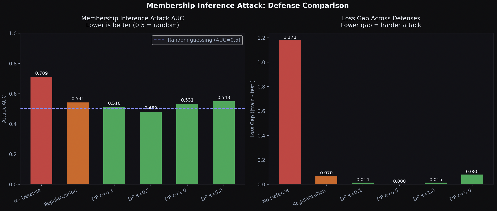

# Membership Inference Attack

I built this after reading about privacy vulnerabilities in ML models, specifically, how models trained on sensitive data can accidentally leak information about who was in the training set. I wanted to actually simulate this and see how bad it could get, and whether differential privacy actually helps.

## What is a membership inference attack?

Say a hospital trains a model on patient records. An attacker wants to know: was a specific patient's data used to train this model? They never see the training data directly. But it turns out models behave differently on data they've seen before vs data they haven't. They're more confident, make fewer mistakes. That difference is enough for an attacker to make a pretty good guess.

I thought this was kind of scary when I first learned about it so I built a simulation to see it for myself.

## What I found

The short version: overfitting is really bad for privacy, and differential privacy actually works.



| Defense | Attack AUC | Loss Gap | Risk |
|---|---|---|---|
| No defense at all | 0.709 | 1.178 | HIGH |
| Regularization | 0.541 | 0.070 | MEDIUM |
| DP (epsilon=0.1) | 0.510 | 0.014 | LOW |
| DP (epsilon=0.5) | 0.480 | 0.000 | LOW |
| DP (epsilon=1.0) | 0.531 | 0.015 | LOW |
| DP (epsilon=5.0) | 0.548 | 0.080 | LOW |

AUC of 0.5 means the attacker is basically guessing randomly — no useful signal. Without any defense the attacker hits 0.709 which is pretty scary for a healthcare model. With differential privacy at epsilon=0.5 it drops to 0.480 was actually below random, meaning DP completely kills the attack.

Regularization helps but isn't enough on its own. The attacker still has a signal. DP is the one that actually makes the problem go away.

## Some terms I kept using

**Loss**: how wrong the model is on a prediction. Low loss = confident and correct.
The key thing is that overfit models have way lower loss on training data than on
new data. That gap is what the attacker exploits.

**Generalization gap**: the difference between train accuracy and test accuracy.
Big gap means the model memorized instead of learned. Bad for privacy.

**AUC**: basically the attacker's success rate. 0.5 = random guessing. 1.0 = 
perfect attack. Anything above 0.6 is concerning for a real system.

**Regularization**: a technique that stops the model from memorizing too hard.
Helps privacy but doesn't fully solve it.

**Differential privacy**: adds calibrated noise during training so the model
can't memorize individual records. Epsilon controls how much noise: smaller epsilon = more noise = stronger privacy but less accuracy.

## How to run it

```bash
python3 -m venv venv && source venv/bin/activate
pip install numpy matplotlib scikit-learn
python main.py
```

## Files

- `target_model.py` - the model being attacked, trained on synthetic patient data
- `attack.py` - the actual membership inference attacker
- `defense.py` - tests regularization and differential privacy as defenses
- `main.py` - runs everything and plots the results

## Why I built this

I'd been working on differential privacy (see my differential-privacy-demo repo) and wanted to understand what it actually defends against in practice. Membership inference is one of the main attacks DP is designed to prevent. Building the attack first made the defense make a lot more sense.

This also connects to federated learning where if a server can infer membership from model updates, the privacy guarantee of federated learning kind of falls apart. That connection to my federated-poison-sim project is what made this feel worth
exploring.

## What I'd do next
- Try shadow model attacks which are apparently much stronger
- Implement proper DP-SGD with gradient clipping instead of input noise
- Test on image data instead of tabular data
- Actually measure how much accuracy you lose at each epsilon value